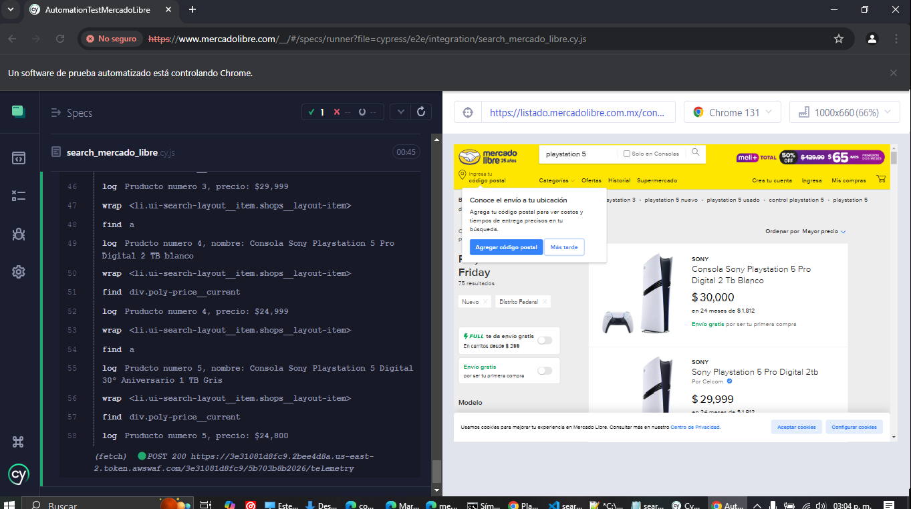

# Documentacion de prueba automatizada testing producto mercado libre

## Pre-requisitos
-tener instalado nodejs y npm

## Clonar repositorio
-link:https://github.com/LucioGh/TestingProductML.git

## ejecutar Test
-Ubicarse en la carpeta raiz del proyecto
-ejecutar comandos para iniciar prueba
```
npm install
npm run cypress:open
```

-Seleccionar pruebas e2e
-Hacer click sobre el archivo 'search_mercado_libre.cy.js' para iniciar ejecucion
-Una vez finalizado se mostrara el reporte y pasos ejecutados en la prueba

Extra points
